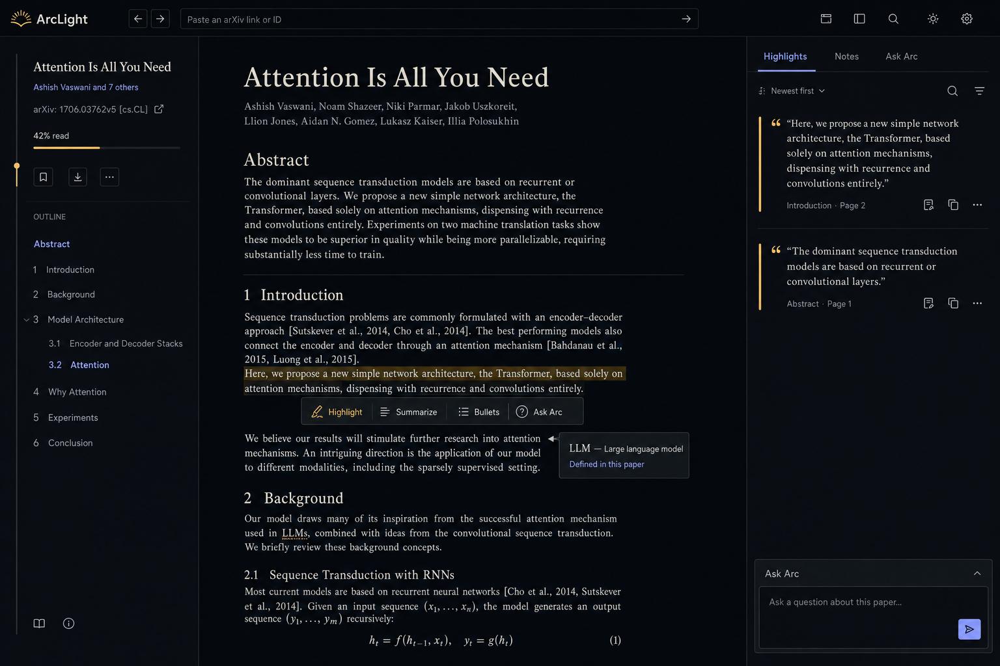

# ArcLight

ArcLight turns arXiv links into a focused local reading workspace. It restyles available arXiv HTML, discovers acronym definitions from the paper, keeps highlights and generated notes in the browser, and routes questions through the Codex CLI already installed on your computer.



## Start it

ArcLight requires Node.js 20 or newer and npm. From this directory:

```bash
npm install
npm start
```

`npm start` creates a production build, starts ArcLight at `http://127.0.0.1:8787`, and opens the default browser. On macOS you can also double-click `Launch ArcLight.command`; on Windows use `Launch ArcLight.cmd`.

## Build the Mac app

```bash
npm run app:build
```

This produces `release/mac-arm64/ArcLight.app` — a standalone desktop app with its
own Dock icon and menu bar, no browser involved. Drag it to `/Applications`. The
Express server runs inside the app on a free loopback port, so it never collides
with a dev server and closing the window stops the server with it.

`npm run app` runs the same thing unpackaged, for working on the shell itself.

The app serves itself on a fixed port (8788, override with `ARCLIGHT_PORT`) rather
than an ephemeral one. Browser storage is keyed by origin, so a port that moved
between launches would discard your highlights, chat history and recent papers each
time you opened the app. Only one instance runs at a time; launching again raises
the existing window. Port 8787 is left free for `npm start`, which means the browser
build and the app keep separate stores.

The renderer loads over `http://127.0.0.1`, never `file://`, and runs with
`contextIsolation` on and `nodeIntegration` off. That matters because ArcLight
renders third-party HTML from arXiv: it keeps a sanitiser bypass at the cost of
scripting in a sandboxed page rather than code execution on your Mac. Links to
arXiv and elsewhere open in your real browser instead of navigating the app.

The build is unsigned beyond a local development certificate, which is fine on the
machine that built it. Running it on another Mac needs signing and notarisation
with an Apple Developer account.

For development with live reload:

```bash
npm run dev
```

The client runs on `http://127.0.0.1:5173` and proxies its local API to port 8787.

## Read a paper

The load screen remembers the last twelve papers you opened. Selecting one reopens
it from the local cache instantly; a paper too large to have been cached is fetched
again. `×` forgets a paper and deletes its cached copy.


Paste any of these into the opening field:

- `1706.03762`
- `1706.03762v5`
- `https://arxiv.org/abs/1706.03762`
- `https://arxiv.org/pdf/1706.03762.pdf`
- a legacy identifier such as `hep-th/9901001`

ArcLight first requests arXiv’s structured HTML and then tries ar5iv. Some old, newly submitted, very large, or unusual papers have no usable HTML conversion. In that case ArcLight leaves the original arXiv PDF available and the bundled sample remains fully interactive.

## Reading tools

- Hover or focus a dotted acronym to see the expansion detected from that paper.
- Select article text to open Highlight, Summarize, Bullets, Simplify, and Ask Arc.
- Summarize, Bullets, and Simplify replace the selected passage in the article itself. Each one keeps the original text alongside it, so `Show full text` flips back and `Restore passage` removes the rewrite. These live for the session and are gone after a reload.
- Simplify re-explains a passage in everyday language with an analogy, for reading outside your field.
- Highlights and chat history are saved per paper in browser local storage.
- The last imported, normalized paper is cached locally and reopens after a refresh, including when the upstream HTML is temporarily unavailable.
- Press Cmd+F to find in the paper. Every match is highlighted, Enter and Shift+Enter step through them, and Escape closes the bar.
- Open the sun menu for text size and dark, dim, or light reading themes; the same controls remain available on phones.
- On smaller screens, the outline and workspace open as touch-friendly drawers.
- Failed summaries, bullet notes, and chat answers can be retried in place; generated notes can be copied with one click.

## Connect Codex

ArcLight calls the local `codex` executable; it does not need an ArcLight API key.

If Codex reports that it has reached its usage limit, ArcLight retries the same
request through the local `claude` executable, which reuses your existing Claude
sign-in and likewise needs no API key. The handover happens only on an exhausted
allowance: a Codex that is missing, signed out, timed out, or crashing is
reported as an error rather than hidden behind a Claude answer. Responses served
this way carry `"provider": "claude"`. Once the limit is seen, the page stops
retrying Codex and addresses the rest of the session to Claude directly, which
saves roughly nine seconds a request; reloading the page tries Codex again. Set `ARCLIGHT_CLAUDE_MODEL` to choose the
model (default `claude-sonnet-5`). Check the CLI and sign in if needed:

```bash
codex --version
codex login
```

Every request runs from a fresh temporary directory with a minimal environment using `codex exec --ignore-user-config --model gpt-5.5 --ephemeral --sandbox read-only`. Pinning the model keeps ArcLight working even when an older CLI cannot parse the newest model catalog; set `ARCLIGHT_CODEX_MODEL` when launching ArcLight to use another model supported by your local CLI. ArcLight sends the paper title, abstract, a bounded portion of the paper text, the selected passage when present, and recent turns from this paper’s chat. The process cannot write to the workspace through this integration. A request times out after 90 seconds, after which ArcLight terminates the process and its descendants.

## Privacy and security

- Papers come only from validated arXiv identifiers and allowlisted arXiv/ar5iv hosts.
- Imported HTML is stripped of scripts, forms, event handlers, unsafe URL schemes, and remote navigation chrome on the server, then sanitized again in the browser.
- The local API accepts only loopback hosts/origins. Mutating requests require a private, HttpOnly same-site session capability to block cross-site and DNS-rebinding access.
- Highlights, notes, appearance settings, and chat history stay in this browser’s local storage.
- ArcLight reports a visible warning if browser storage is full or unavailable instead of pretending new annotations were saved.
- ArcLight has no account system, analytics, hosted backend, or remote database.
- Asking Codex uses the network and account configured by your local Codex installation.

To remove saved reading data, clear site data for `127.0.0.1:8787` in your browser.

## Commands

```bash
npm test          # full automated suite
npm run build     # type-check and production build
npm run serve     # serve an existing build without opening a browser
```

## Troubleshooting

**“ArcLight could not find structured HTML”** — Open the source PDF from the left rail or try again later; arXiv/ar5iv conversions can lag a submission.

**“Codex is not installed”** — Install the Codex CLI and make sure `codex --version` works in the terminal used to launch ArcLight.

**“Codex needs you to sign in”** — Run `codex login`, finish sign-in, then retry the note or question.

**Port 8787 is already in use** — Stop the process using that port or launch with a different port: `PORT=8790 npm run serve`.

## Project map

- `src/components/` — reader, outline, article, selection toolbar, workspace, and chat UI.
- `src/lib/` — local API, range serialization, and versioned workspace storage.
- `server/arxiv.ts` — arXiv validation and allowlisted retrieval.
- `server/paper.ts` — sanitization, structure normalization, and acronym extraction.
- `server/codex.ts` — bounded, read-only Codex process bridge.
- `design/` — accepted desktop/mobile visual references and implementation tokens.
